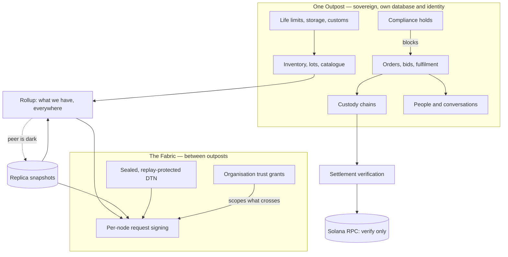

# TID Wayfarer — Platform Overview

A logistics system for operations spread across places that cannot assume a
network: depots, farms, ships, research stations, orbital platforms, and
eventually surface bases further out. It answers three questions that are
easy to state and hard to keep true at once:

1. **What do we have, everywhere?** — one view across every location.
2. **How do we get more of it, here?** — a marketplace where capacity is
   brokered rather than bought whole.
3. **Is any of that still true?** — provenance and age on every figure, so a
   number that cannot be trusted says so.

Connectivity is treated as a property of the data, not an error condition. An
outpost that is out of contact for a week is a normal state of that outpost,
not an outage to be hidden.

> **A note on this document.** It describes what is built, and says plainly
> where something is designed-but-not-built or still aspirational. An earlier
> version of this file described a Turborepo monorepo with a Next.js frontend,
> Solana Anchor contracts, libp2p messaging and IPFS storage — none of which
> exist in this repository. That kind of drift is worse than no document,
> because it is indistinguishable from documentation until someone acts on it.

---

## The shape of a deployment

Every deployment is an **Outpost**: a sovereign node with its own PostgreSQL
database, its own Ed25519 identity, its own user accounts, and its own
authority over its own stock. There is no central server that outposts are
clients of.

Outposts form a **fabric**. They know each other through a node registry,
authenticate each other with per-node request signatures, and answer each
other's questions — but none of them can write another's data. The fabric is
a federation, not a cluster.

Inside that, an **organisation** is the commercial boundary. Several companies
can share one outpost without seeing each other's holdings; one company can
span several outposts. Trust between organisations is bilateral, revocable, and
verifiable offline. `marketplace` is the only scope one organisation may grant
another; `inventory` is never grantable.
([design](./OrgBoundaries.md))

---

## What is built

### Resources — what you have, and where

- **Inventory and lots** per outpost: quantities, locations, reorder points,
  batch and serial tracking, expiry, quarantine, recall tracing.
- **A parts catalogue**: part numbers, manufacturer and supplier codes,
  supersession chains (A was replaced by B) and symmetric alternates, pack
  sizes, lead times, preferred sourcing, HS codes and country of origin,
  storage temperature and humidity ranges, hazard class and UN number.
- **Life limits** per unit: cycles, running hours, or calendar days, reported
  against whichever clock binds first. Usage accrues against the individual
  unit, which is the whole reason serialised parts exist.
- **Barcode and QR capture** — one field, hardware-scanner first, camera where
  the browser supports it.
- **Cross-location rollup** — "what do we have, everywhere", merged across
  outposts with a per-location breakdown, because 500 L spread over six sites
  is not 500 L you can use anywhere.
- **Replication**, so a dark site still counts. Each peer's last reported
  summary is held locally and used when the peer cannot be reached, with the
  age attached and counted separately. A total built partly from snapshots is
  reported as uncertain in both directions; a total missing a site entirely is
  reported as a floor. Those are different warnings and are not blurred.
  ([details](#replication-in-one-paragraph))

### Movement — how it gets there

- **Orders, bids and fulfilment**: an outpost posts a need, carriers bid, one
  is accepted, custody moves.
- **Cost and rate modelling**: rate cards, mass and volume charges, handling
  fees, surcharges, and bid comparison on cost-per-kg and reliability rather
  than headline price alone.
- **Custody chains**: signed receipts at each handover, so "who had this when"
  is answerable after the fact and not merely logged.
- **Compliance holds**: a hold blocks a shipment by default. Clearing one means
  the problem was fixed; overriding one means shipping anyway, which is
  sometimes genuinely necessary and is always recorded against the person who
  decided it.
- **Documents**: customs declarations and manifests generated from the
  catalogue, including the HS code, origin, hazard class and UN number a border
  actually asks for.
- **Capsules**: shared hulls and manifests. Partially modelled — see
  [what is not built](#what-is-not-built).

### Communication — between machines, and between people

- **Per-node request signing** over the fabric: method, path, timestamp and a
  body hash, so a captured signature is valid for one request shape only. Key
  rotation and revocation with audit history.
- **Post-quantum sealed messaging**: ML-KEM-1024 encapsulation → HKDF-SHA256 →
  AES-256-GCM, with sender and recipient node ids as associated data. Payloads
  are opaque in transit **and at rest**, which matters because a bundle can sit
  queued for days.
- **Delay-tolerant networking**: send queues per destination and a forwarder
  retries until the far side comes back. Reception is **idempotent** — the
  envelope binds a message id, a lifetime and the recipient under the
  signature, and a message id already seen is absorbed rather than reprocessed.
  That is as much about honest operation as about attack: a forwarder cannot
  tell a lost message from a lost acknowledgement, so duplicates are routine on
  a bad link. ([spec](./DelayTolerantMessaging.md))
- **People and conversations**: an organisation's owner or admin creates
  accounts, sets roles, resets passwords and deactivates accounts. Internal
  team channels, direct messages between colleagues, and buyer↔seller threads
  **anchored to the order or bid they concern** — so a cross-company channel is
  authorised by a transaction rather than by a directory of everyone's staff.
  ([details](./PeopleAndMessages.md))

### Operations

- Fleet telemetry with autonomous response; a rules engine of DB-driven
  policies with per-asset cooldowns; command actuators with delivery
  acknowledgements, where `LOCKDOWN` actually refuses writes rather than
  setting a flag.
- Structured logging, request and trace correlation, Prometheus metrics.
- A map view and movement trails as GeoJSON.
- An operator console and fifteen UI pages: vanilla ES modules, no build step.
  Status uses a deliberate four-state vocabulary — **live / lagging / dark /
  unknown** — because "unknown" is a real state and must never be rendered as
  "fine".

### Replication in one paragraph

The rollup fans out live reads to every peer. That is honest but only works
for sites currently in contact, so a farm office on a weekly uplink was
invisible six days out of seven and the fabric-wide total quietly meant "what
we have at the places answering the phone". Now each peer's last reported
summary is kept locally, keyed by organisation, and used as a fallback. Age is
taken from the **peer's own clock**, so re-reading a snapshot never makes the
stock look fresher than it is. Past a configurable horizon (30 days by
default) a snapshot is still listed but stops being summed — a figure from six
months ago is worse than no figure, because somebody will act on it. A replica
is never authoritative: it must not back a reservation, a custody transfer or a
settlement. `?fresh_only=true` returns the strict live-only floor for anything
that commits.

---

## TIDasToken (TIDAT)

The unit of account for the marketplace, by design: the thing a buyer pays and
a carrier is paid in when capacity is traded between parties who may have no
other settlement rail in common.

**Built:** settlement *verification*. Before an order is marked `settled`, the
payee, the amount and the mint are confirmed against a Solana JSON-RPC
endpoint. A payee with no recorded wallet address yields `Unverifiable` rather
than a pass — that was a real bug: `users.wallet_address` had no write path, so
it was always NULL and any successful transaction settled any order.

**Not built:** on-chain escrow contracts, staking, DAO governance, gasless
relayers, NFT inventory proofs. There are no Solana programs in this
repository — the integration is an RPC client that reads and verifies, not a
contract that holds funds. Treat every token function beyond verification as a
design intention.

---

## Repository layout

```
apps/api/              The Rust service. Axum + sqlx. 41 route modules,
                       20 background services.
packages/db/           Migrations (39) and shared DB types.
services/mesh-relay/   Go sidecar: drains dtn_outbox and delivers to peers.
                       Network fan-out and frequent retries suit Go's
                       concurrency model, and keeping it out of the API
                       process means a flaky peer cannot stall request
                       handling.
shared/static/         The frontend. Plain ES modules, no build step.
deploy/helm/           Helm chart, with example values for a core HQ, a
                       terrestrial outpost and a Mars outpost.
deploy/operator/       Go Kubernetes operator with an `Outpost` CRD.
scripts/               Dev and test helpers.
Documentation/         This file and the design documents.
```

A Cargo workspace of two members, not a Turborepo. `liboqs/` and
`liboqs-python/` are unreferenced submodules left over from an earlier
approach — the post-quantum primitives come from the `pqcrypto-*` crates, and
CI no longer fetches them.

### Crates actually used

| Purpose | Crate |
|---|---|
| Web framework | `axum`, `tower`, `tower-http`, `tokio` |
| Database | `sqlx` (PostgreSQL, compile-time checked queries) |
| Signatures | `ed25519-dalek` |
| Post-quantum | `pqcrypto-mlkem`, `pqcrypto-mldsa`, `pqcrypto-traits` |
| Symmetric crypto | `aes-gcm`, `hkdf`, `sha2` |
| Auth | `jsonwebtoken`, `argon2` |
| HTTP client | `reqwest` |
| Observability | `tracing`, `tracing-subscriber` |

No `libp2p`, `noise`, `sodiumoxide`, `diesel`, `ipfs-api`, `anchor-lang` or
local-LLM bindings. Earlier versions of this document listed all of them.

---

## What is not built

Named because a roadmap that reads as a feature list is how the previous
version of this document went wrong.

- **Chat over DTN.** A conversation lives on one outpost. The schema carries
  `via_node_id` and the write path is shared so the DTN receive side can insert
  messages, but the routing is not wired: two people on *different* outposts
  cannot yet talk to each other.
- **Multi-hop DTN relaying.** The receiver requires the transport identity to
  equal the envelope author, so a bundle cannot traverse an intermediate
  outpost. Real relaying needs a hop-by-hop layer around the end-to-end
  envelope.
- **Partition reconciliation.** If two disconnected outposts both allocate the
  last unit, nothing detects it. Replication makes the *view* survive a
  partition; it does not make *writes* converge, and conflating the two would
  be the dangerous reading of this document.
- **Automatic replenishment.** Low stock is detected per-outpost and flagged
  fabric-wide, but nothing acts on it. Crossing a threshold should draft an
  order rather than wait for somebody to notice.
- **Shared capsules with proportional settlement.** Consolidating several
  buyers' orders into one hull, with per-item custody and settlement split by
  mass or volume. The most-requested marketplace mechanic, and only partly
  modelled.
- **Offline settlement.** Closing a trade where no chain is reachable.
  [Designed](./OfflineSettlement.md), not built.
- **On-chain escrow, staking, DAO governance, NFT inventory proofs.** See the
  token section above.
- **Organisation-issued user credentials (SSO).** Accounts are per-outpost, so
  a person working across two outposts has two of them.
- **Condition monitoring into life limits.** `cycles_used` and `hours_used` are
  recorded by hand. Fleet telemetry already arrives and should accrue against
  the unit automatically.
- **Vendored map libraries.** The map and bodies pages still load Leaflet and
  Cesium from a CDN, which is precisely wrong for an offline-first tool.

---

## How the pieces relate



---

## Where to read next

| Document | Covers |
|---|---|
| [Org Boundaries](./OrgBoundaries.md) | How two companies share one outpost; what a trust grant can never carry. |
| [Delay-Tolerant Messaging](./DelayTolerantMessaging.md) | The envelope format and replay protection. Normative for a peer implementation. |
| [People & Messages](./PeopleAndMessages.md) | Accounts, roles, and why a buyer↔seller thread is anchored to a deal. |
| [Offline Settlement](./OfflineSettlement.md) | Design for closing a trade with no chain reachable. Not built. |
| [Contributing](./CONTRIBUTING.md) | Building it, what the tests expect, and the bugs that shaped the conventions. |
