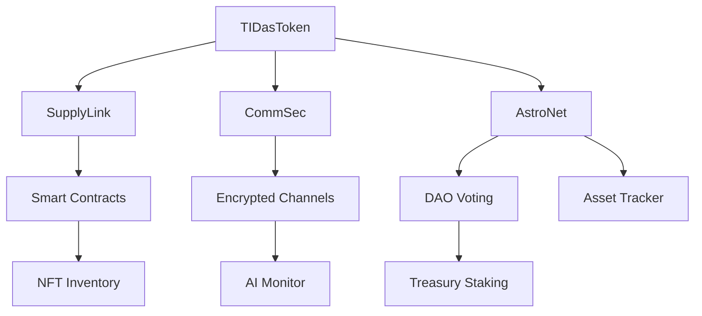

# 🌐 TIDasONE Platform Overview

**TIDasONE** is a decentralized cybersecurity and logistics ecosystem built to support 
terrestrial and interplanetary commerce, secure communications, and cross-domain,
coordination of all assets. It fuses physical and digital assets into a unified operational backend, 
powered by the **TIDasToken**.

---

## 🔑 TIDasToken (Utility Token)

- **Symbol**: `TIDAT` (TIDasToken)
- **Type**: Multi-purpose Utility Token
- **Chain**: Solana (primary), future cross-chain via Polkadot

### 🛠️ Token Functions

- **Transactions**: Buy goods, tools, and hardware via SupplyLink
- **Access**: Unlock secure modules in CommSec
- **Governance**: Vote on AstroNet DAO proposals
- **Staking**: Prioritize node sync, delivery, or data access
- **Rewards**: Earn for routing, data sharing, or delivery proof

### 🔐 Token Properties

- Deflationary supply (burns on high-value use)
- Gasless transactions via relayers
- Compatible with Solana Pay and BitPay
- NFTs bound to token IDs for inventory proofs

---

## 🧠 TIDasONE Modules

### 1. 📦 SupplyLink – Decentralized Fulfillment & Commerce

- **Tokenized Inventory**: Goods, tools, hardware, space tech linked to NFT or hash-ID
- **Smart Contracts**: Enforce escrows, shipping, and conditions
- **Marketplace**: Trade physical + digital tools, firmware, resources
- **AI Fulfillment**: Smart routing to warehouse, drone, or space node
- **Verification**: Signed contracts confirm delivery or pickup

> Built with: Rust/Anchor (Solana contracts), IPFS (goods), Axum + React frontend

---

### 2. 🔒 CommSec – Secure Communications

- **End-to-End Encryption**: P2P or endpoint-secure comms
- **Field Tools**: Missions, stealth beacons, task updates
- **AI Monitoring**: Detect anomalies or leaks in message traffic
- **Offline Mode**: Delay-Tolerant Networking (DTN) for dark zones

> Built with: `libsodium`, `libp2p`, `noise-protocol`, local LLMs (Rust bindings)

---

### 3. 🛰️ AstroNet – Interplanetary Registry + Governance

- **Asset Tracker**: Monitor fuel, water, gear, across Earth/ISS/Moon/Mars
- **DAO Voting**: Decentralized allocation and mission governance
- **Event Ledger**: Synced with IPFS + future satellite nodes
- **Geo-Dashboard**: Visual logistics across orbits + surface bases

> Built with: CesiumJS, Filecoin/IPFS, Rust DAO engine, DTN support

---

## 🧬 Interconnected System Flow

=============================================================================================================================================
=============================================================================================================================================

🏗️ TIDasONE Monorepo Architecture

TIDasONE uses a modular monorepo managed by Turborepo, supporting full-stack Rust services, 
smart contracts, AI modules, and shared logic across the platform.
🗂️ Folder Structure
tidasone/
├── apps/
│   ├── web/                # Frontend (Next.js + Tailwind)
│   ├── api/                # Main Rust API (Axum-based)
│   └── dashboard/          # AstroNet Control UI (optional split)
├── packages/
│   ├── contracts/          # Smart contracts (Solana: Anchor, Rust)
│   ├── messaging/          # CommSec backend (libp2p/NaCl)
│   ├── fulfillment/        # SupplyLink logic
│   ├── governance/         # AstroNet DAO tooling
│   ├── db/                 # Diesel / sqlx models and migrations
│   └── utils/              # Shared encryption, types, token handlers
├── infra/                  # Terraform / Pulumi infra-as-code
├── scripts/                # Dev scripts, deploy helpers
├── .env.example
├── turbo.json              # Turborepo config
└── README.md

=====================================================================================
🧱 Rust-Specific Tools and Crates

Purpose	Crate / Tool
Web Framework	axum, tower, tokio
DB ORM	sqlx or diesel
Smart Contracts	anchor-lang, solana-program
Messaging	libp2p, noise, sodiumoxide
File Storage	ipfs-api, rust-ipfs
Auth + Crypto	jsonwebtoken, argon2, ring, ed25519-dalek
LLMs/Inference	llm, ggml, bindings to mistral.cpp
Testing	proptest, tokio::test, assert_json_diff

====================================
If you're ready, the next steps are:

🧪 Scaffold the Rust API project (using Axum + sqlx + PostgreSQL)

📦 Set up workspace crates for contracts, messaging, governance, etc.

🧬 Design & implement DB models for Users, Assets, Shipments, DAO

🔒 Integrate libp2p or noise for encrypted comms engine

🛰️ Plan the ledger sync & DAO modules for AstroNet

📡 Hook in Solana contracts for TIDasToken + NFTs
