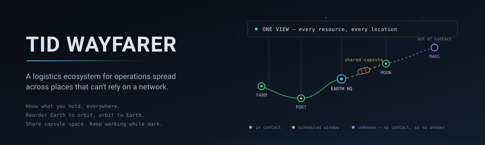

<p align="center">
  
</p>

# TID Wayfarer 

[](https://www.rust-lang.org/)
[](https://github.com/TangoisdownHQ/TID-WAYFARER/actions)
[](./LICENSE)
[](./Documentation/CONTRIBUTING.md)


**TID Wayfarer is a logistics ecosystem for operations spread across places that
can't rely on a network.**

Know what resources you have, everywhere you have them. Reorder what's running
low without paperwork, in either direction — Earth to orbit, orbit to Earth,
warehouse to farm. Share capsule space with other shippers instead of paying
for a whole one. Keep doing all of it while the link is down.

A farm co-op tracking seed and fertilizer across six fields has the same
problem as a lunar outpost tracking oxygen and spares: inventory in many
places, replenishment that takes time, partners who need to see the same
picture, and connectivity that can't be assumed. TID Wayfarer treats those as
one problem.

### 📖 Documentation

| Read this | If you want to know |
|---|---|
| [Description](./Documentation/Description.md) | The platform vision, the token model, and a module deep-dive. |
| [Org Boundaries](./Documentation/OrgBoundaries.md) | How two companies share one outpost without seeing each other's stock — what a trust grant can and can never carry. |
| [Delay-Tolerant Messaging](./Documentation/DelayTolerantMessaging.md) | The envelope format, and why a message id, a lifetime and a destination all sit under the signature. Normative if you are writing a peer. |
| [People & Messages](./Documentation/PeopleAndMessages.md) | Running accounts for your staff, and why a buyer↔seller conversation is anchored to an order rather than to a contact list. |
| [TIDasToken (TIDAT)](./Documentation/Token.md) | What the token is for, what settlement actually verifies, and the long list of token features that are design intention rather than code. |
| [Token Build Plan](./Documentation/TokenBuildPlan.md) | How to get from there to a working rail, in order — and which "not built" items are better left unbuilt. |
| [Offline Settlement](./Documentation/OfflineSettlement.md) | Design for closing a trade where no chain is reachable. Not yet built. |
| [Contributing](./Documentation/CONTRIBUTING.md) | How to build it, what the tests expect, and the conventions the code follows. |

Each of those explains the *reasoning*, not just the shape — usually including
what the earlier version got wrong, because that is the part that tells you
which constraints are real.

---

## Why it's built this way

Every deployment is an **Outpost** — a sovereign node (Earth HQ, a farm office,
a Moon base, Mars-Jezero, a ship in transit) running the identical core, holding
its own Ed25519 identity and its own database.

That means an outpost keeps working when it's cut off. It doesn't degrade to
read-only, it doesn't queue up at a central server, and it doesn't pretend the
data it's showing you is fresh when it isn't. Three design rules follow from it,
and they show up everywhere in the code:

1. **Store and forward, never block.** Messages, commands, and settlements are
   all recorded locally the moment they're made, then converge when a route
   exists. Same shape in all three.
2. **State carries its age.** A reading without a timestamp is misleading, so
   time-since-contact is a first-class field, not a footnote. The operator
   console leads with it.
3. **Never claim what wasn't checked.** "Delivered" and "settled" are different
   words for a reason, and so are "unsupported" and "failed". A settlement that
   couldn't be confirmed is recorded as unconfirmed — not waved through.

---

## 🧩 Modules

### 📦 SupplyLink — Inventory, Orders & the Capsule Marketplace
**Status: Core implemented ✅** (capsule sharing + escrow pending)

The logistics layer. Inventory, packages, kits, and an asset registry, plus a
working marketplace:

- **Post an order** — "100 kg of seed, delivered to Jezero by April" — with
  quantity, units (kg/L/m³/each), a delivery body (NAIF id) and coordinates, a
  deadline, and a price ceiling.
- **Receive competing bids** with price and estimated transit days.
- **Accept one**, then follow ship → deliver → settle, with settlement state
  spelled out rather than assumed.
- Assignment workflow (`/api/supplylink`) for delivery tracking.
- Operator UI at `/ui/market.html`.

Pricing is denominated in **TIDasToken** — because a marketplace spanning a
comms blackout needs value transfer that can be committed locally and settled
later, which is something conventional payment rails cannot do.

Planned: **shared capsules** (multiple orders consolidated into one shipment
with a manifest and split settlement), escrow contracts, IPFS-backed inventory
proofs.

### 🛰️ AstroNet — Resource Registry & Cross-Domain Coordination
**Status: Tracking + resource rollup implemented ✅** (replication + ledger pending)

Where everything is, what condition it's in, and what it holds:

- **One view of every resource, everywhere** — `GET /api/rollup/inventory`
  fans signed reads out to every registered outpost, merges them, and reports
  fabric-wide totals with a per-location breakdown. Operator UI at
  `/ui/resources.html`.

  Two things it refuses to do, both deliberate. It will not present a total as
  a count when a site is out of contact: the response and every affected line
  item carry `complete: false`, because an operator reordering against a
  number that silently omitted three sites is the failure this whole product
  exists to prevent. And it will not report only a sum — 500 L spread over six
  locations is not 500 L you can use anywhere, so the breakdown travels with
  the total. An item can be healthy fabric-wide and still be out at the site
  that needs it, which the reorder flag tracks per location.
- Celestial bodies registry (`/api/bodies`) — assets live on Earth, Moon, Mars,
  ISS, or in transit between them.
- Fleet asset tracking with live telemetry ingestion, anomaly scoring, and
  automatic response (anomaly → diagnostic snapshot, tamper → lockdown,
  malware → network isolation).
- Geo-dashboard endpoints (`/api/map`, `/api/map/fleet`) including per-asset
  movement trails as GeoJSON.
- Peer node registry and sync daemon (`/api/nodes`, `/api/nodes-sync`).

- **Replication** — a peer's last reported summary is kept locally and used
  when that peer is unreachable, so a site on a weekly uplink still counts
  instead of reading as empty. Age comes from the peer's own clock, so
  re-reading a snapshot never makes the stock look fresher than it is. Past a
  horizon (30 days by default) a snapshot is still listed but no longer summed,
  because a figure from six months ago is worse than no figure — somebody will
  act on it. A replica is never authoritative: it must not back a reservation,
  a custody transfer or a settlement, and `?fresh_only=true` returns the strict
  live-only floor for anything that commits.

Planned: automatic reorder when stock crosses its threshold; IPFS event ledger;
DAO voting.

### 🔐 CommSec — Secure Communications
**Status: Implemented ✅**

- Post-quantum **ML-KEM-1024** for key agreement, AES-256-GCM for payloads
  (`apps/api/src/routes/commsec.rs`). `/keypair` returns the **public** key
  only — the secret never leaves the process.
- **Sealed DTN** — payloads are encrypted for the recipient, not merely signed:
  ML-KEM-1024 encapsulation → HKDF-SHA256 → AES-256-GCM, with sender and
  recipient node ids as associated data so a sealed payload can't be replayed
  as though it came from, or was addressed to, a different node. The envelope
  is Ed25519-signed over the *ciphertext*, so a peer authenticates the sender
  before spending work on decryption.

  Payloads are opaque both in transit and **at rest** in `dtn_outbox` — which
  matters because a message can sit queued for days across a blackout. That
  makes it an at-rest problem, not just a transit one.
- **Delay-Tolerant Networking** — `POST /api/dtn/send` queues per destination;
  the forwarder retries with exponential backoff until the outpost comes back
  into contact, landing payloads in the peer's inbox.
- **Replay protection** — the envelope binds a message id, a `sent_at`, an
  `expires_at` and the **destination**, all under the signature, with
  length-prefixed canonical bytes so field boundaries cannot be moved. The
  receiver remembers each `(sender, message id)` for the bundle's lifetime, so
  delivery is **idempotent**: posting the same envelope twice stores one
  message.

  That matters for an honest reason before a hostile one. The forwarder retries
  on a dropped connection, so it cannot tell a lost message from a lost
  acknowledgement — duplicates are ordinary operation on a bad link, not just
  an attack. A retransmit and a replay are indistinguishable at the door, so
  both get the same answer and neither produces a second inbox row.

  Unverified envelopes are now **refused rather than filed**, and
  `/api/dtn/receive` requires a named peer — it previously sat behind the
  general guard, which accepts a user token. Refusals are counted in
  `dtn_rejected` with a reason, so "a peer needs upgrading" and "something is
  replaying our traffic" are distinguishable.
  ([spec and reasoning](./Documentation/DelayTolerantMessaging.md))
- Each outpost's ML-KEM keypair persists (`keys/commsec.json`) and is exchanged
  during node registration alongside the Ed25519 identity. A peer on an older
  build with no KEM key on file still receives plaintext, flagged via
  `dtn_outbox.encrypted`, so a partially-upgraded fabric keeps working.
- End-to-end test harness: `scripts/test_commsec.sh`.

### 🚚 Carriers — UPS, USPS, FedEx, DHL as *legs*
**Status: Implemented ✅**

A commercial carrier is modelled as a subcontracted **leg** of a shipment, not
as a marketplace participant. UPS will never run an outpost, hold a TIDAT
wallet, or sign a custody receipt — so the depot that bid stays accountable
end-to-end, and the carrier is how they fulfil it.

- **It works with no marketplace at all.** An organisation shipping its own
  stock to its own customers has no order and no bid, and still gets addresses,
  labels, tracking and customs paperwork. That single-org case is the point:
  the marketplace is what you grow into, not what you need before anything
  works.
- **Structured addresses** (`/api/addresses`) that extend the body model rather
  than replacing it — `body_id` selects which half of a row is meaningful, so
  Earth gets a postal address a carrier can rate and Mars still gets
  coordinates. Validated against what a carrier needs *before* a carrier is
  asked, so an outpost with no link still catches a missing country.
- **The custody chain records a handover to a party that cannot sign**: null
  `to_node_id`, the carrier and tracking number in `to_label`, and
  `verified = false`. The tracking number is third-party-checkable evidence,
  which is genuinely useful and is **not** a signature — filing it as one would
  weaken every other receipt in the chain.
- **Carrier acceptance checked off the catalogue.** `hazard_class` and
  `un_number` were already modelled, and UN3480 (standalone lithium cells) is
  the most common refusal there is — so USPS air is refused before a label is
  bought, while FedEx ground comes back as "accepted with a declaration",
  which is a different answer and reported as one.
- **`manual` is the default provider** and needs no network: buy the label on
  the carrier's own site and record the tracking number. An aggregator
  (EasyPost) adds live rates, label purchase and automatic tracking on top —
  one integration reaching all four carriers rather than four.
- Tracking polling is **idempotent** (per-event `source_ref` with a unique
  index), because polling is at-least-once and a re-poll would otherwise
  duplicate the whole history.
- Carrier cost is **fiat**; the marketplace leg still settles in TIDAT. Keeping
  the two apart is what keeps a bid comparable.

### 👥 People & Messages — Accounts and Conversations
**Status: Implemented ✅**

- **People administration** (`/api/people`, Settings page) — an org owner or
  admin creates accounts inside **their own** organisation, sets the
  organisation role (`owner` / `admin` / `operator` / `viewer`), resets
  passwords and deactivates accounts. Previously an account could only come
  into existence by signing itself up.
- A new account gets a **one-time password shown exactly once**, read aloud
  rather than emailed: an outpost may have no route to a mail server for days,
  so a flow depending on delivered mail fails exactly when it is needed.
- **Deactivation, never deletion** — someone who signed a custody receipt or
  released a hold is named by those records, and a deleted row would leave a
  shipment attested by nobody.
- The outpost-level security role (`users.role`) is **not** settable here. An
  org admin runs a company on the outpost, which is a different job from
  administering the outpost; conflating them would let one customer's admin
  reach every other customer's data.
- **Conversations** (`/api/chat`, Messages page) — internal team channels,
  direct messages between colleagues, and **buyer↔seller threads anchored to
  an order or a bid**. A cross-company channel is authorised by the
  transaction that justifies it, not by a directory: handing every participant
  a list of every other organisation's staff would leak the org chart, which
  is competitive information on a marketplace where the same companies bid
  against each other.
- Access is thread membership and nothing else — not org membership, so
  someone who joins next month does not inherit a negotiation that closed last
  month. Unread counts ride on the nav on every page.
  ([details](./Documentation/PeopleAndMessages.md))

### 💠 TIDasToken (TIDAT)
**Status: Settlement verification implemented 🧱** (on-chain escrow pending)

The unit of account for the marketplace — payments, staking, governance, and
rewards. Developed in the sibling `TIDasTOKEN/` project; Solana primary.

In-core today: a settlement verifier daemon confirms a recorded payment
actually credited the payee the expected amount of the expected token before an
order reaches `settled`, and `blockchain_feeder` normalizes chain events into
threat/alert records (`/api/bc`).

Planned: **offline settlement** — locally-committed conditional transfers that
anchor to chain on a settlement horizon. A Mars outpost cannot participate in
Solana consensus (light delay is minutes; slot time is milliseconds), and a
ship with no uplink for three days has the same problem for a different
reason, so the chain has to be an eventual anchor rather than the transaction
medium. Design: [Documentation/OfflineSettlement.md](./Documentation/OfflineSettlement.md).

---

## 🏗 Architecture

One Rust/Axum binary (`tid-wayfarer`) per outpost, backed by PostgreSQL:

- **API layer** — 20+ route groups under `/api` (inventory, assets, fleet,
  orders, fulfillments, supplylink, users, nodes, peers, commands, rules, ops,
  dashboard, map, bodies, dtn, fabric…).
- **Background daemons** — peer sync, telemetry processor, command engine, DTN
  forwarder, self-registration, blockchain feeder, settlement verifier. All
  fail soft: a missing table or unreachable peer never kills the API, and
  everything that crosses the network retries with exponential backoff.
- **Autonomy** — telemetry is evaluated against DB-driven policies
  (`/api/rules`) with per-asset cooldowns; firings queue commands and are
  auditable at `/api/ops/events`.
- **Command actuators** — a pushed command *does* something. The receiver
  dispatches to a handler registry (`LOCKDOWN`, `UNLOCK`, `ISOLATE_NETWORK`,
  `REJOIN_NETWORK`, `DIAGNOSTIC_SNAPSHOT`) whose effects persist in
  `outpost_state`, and reports the outcome, which core records as the ack. An
  unimplemented command answers `unsupported` rather than silently claiming
  success. A locked-down outpost refuses mutating requests with `423` while
  still serving reads and `/commands/execute`, so `UNLOCK` can reach it.
- **Signed telemetry** — a node with a registered `hmac_secret` must send a
  valid `X-Telemetry-HMAC` over the body; unsigned telemetry from that node is
  rejected before it can drive autonomy. Rotate via
  `POST /api/nodes/:id/telemetry-secret` (admin).
- **Per-node fabric auth** — peers authenticate with an Ed25519 signature over
  `fabric|METHOD|path|timestamp|sha256(body)`. Binding method, path and body
  means a captured signature can't be replayed onto another route or a mutated
  payload; the timestamp bounds reuse to 5 minutes. `FABRIC_AUTH` selects
  `both` / `signed` / `legacy` so a running fabric can be rolled over
  node-by-node.
- **Key rotation & revocation** — `POST /api/nodes/:id/revoke` makes the guard
  refuse a node's signatures immediately; `rotate-key` swaps its Ed25519 key,
  requiring a signature from the **new** key so a rotation can't strand a node
  with a key nobody holds. Rotation clears a revocation — that's the recovery
  path — and every change lands in `node_key_history` with the admin who made
  it.
- **Observability** — structured `tracing` logs (`RUST_LOG`, `LOG_FORMAT=json`).
  Every request carries a `request_id`; every telemetry row mints a `trace_id`
  stamped onto each ops event and queued command it causes, travelling inside
  the pushed command so the executing outpost logs the same id. One
  `WHERE trace_id = …` returns the whole causal chain: telemetry → rule firing
  → command → execution. `GET /metrics` exposes Prometheus counters and gauges,
  outside the auth guard so a scraper needs no fabric credential.
- **Operator console** — `/ui/console.html` answers "what needs me right now?"
  A time-since-contact rail sits above everything and states plainly whether
  the readings below can be trusted. Beyond ok/warn/bad the palette carries a
  fourth state — *unknown because out of contact* — which is the characteristic
  condition here and is not a fault. A "needs a decision" list surfaces only
  genuinely actionable states, and a trace box expands any `trace_id` into its
  causal chain. Self-contained, no CDN.
- **Kubernetes-native** — Helm chart (`deploy/helm/tid-wayfarer`) and a Go
  operator with an `Outpost` CRD (`deploy/operator`) declare outposts as
  cluster resources.

```
TID-WAYFARER/
├── apps/api/                # tid-wayfarer core (Rust, Axum, sqlx)
│   └── src/
│       ├── main.rs          # entrypoint: router + daemons
│       ├── routes/          # API route groups
│       └── services/        # daemons, identity, autonomy, crypto, settlement
├── packages/db/migrations/  # PostgreSQL schema migrations
├── shared/static/           # operator console + marketplace UI
├── deploy/
│   ├── helm/tid-wayfarer/   # Helm chart
│   └── operator/            # Go operator + Outpost CRD
├── scripts/                 # wait-for-db.sh, test_commsec.sh, helpers
├── liboqs/ liboqs-python/   # post-quantum crypto (submodules)
└── docker-compose.yml       # local multi-outpost stack
```

---

## 🛠 Build & Run

Requirements: latest stable [Rust](https://www.rust-lang.org/tools/install),
`cargo`, PostgreSQL (or Docker), `jq`, `curl`.

```bash
cp .env.example .env   # DATABASE_URL, JWT_SECRET, OUTPOST_NAME, …
SQLX_OFFLINE=true cargo run --bin tid-wayfarer   # port 3000
```

Local multi-outpost stack (core + outpost B + mesh relay + Postgres):

```bash
docker compose up -d
```

Kubernetes:

```bash
helm install tid-wayfarer deploy/helm/tid-wayfarer -f deploy/helm/tid-wayfarer/values-core-hq.yaml
# or operator-managed outposts:
kubectl apply -k deploy/operator/config/default
kubectl apply -f deploy/operator/config/samples/
```

Quick checks:

```bash
curl localhost:3000/api/health    # {"status":"ok","service":"..."}
curl localhost:3000/api/outpost   # identity (name, role, bodyId, region)
open  localhost:3000/ui/console.html
```

---

## 🔬 Testing

```bash
SQLX_OFFLINE=true cargo test --lib            # 134 unit tests, no database needed
./scripts/test_commsec.sh                     # PQC end-to-end

# Integration suites. These need a migrated Postgres; without TEST_DATABASE_URL
# they skip rather than fail, so `cargo test` stays useful on a machine with no
# database — a test that goes red for want of infrastructure trains people to
# ignore red.
export TEST_DATABASE_URL=postgres://postgres:…@localhost:5433/tidasone
SQLX_OFFLINE=true cargo test --test boundaries    # 12 — organisation isolation
SQLX_OFFLINE=true cargo test --test dtn_replay    # 11 — DTN replay protection
SQLX_OFFLINE=true cargo test --test chat_people   # 11 — accounts and conversations
SQLX_OFFLINE=true cargo test --test replication   #  8 — dark sites still counting
SQLX_OFFLINE=true cargo test --test carriers      # 14 — commercial carrier legs
```

Point `TEST_DATABASE_URL` at a **throwaway** database. The suites insert
fixtures and do not clean up; run them against your dev database and the node
registry fills with dark fixture peers that every rollup then waits to time
out.

`SQLX_OFFLINE=true` is not optional. `sqlx::query!` verifies every query against
a live database **at compile time**; offline mode compiles against the committed
query cache instead, which is also how the Docker image builds. Omit it with a
`DATABASE_URL` pointing at an unmigrated database and you get dozens of errors
that look like unrelated Rust problems.

The integration suites are worth describing by what they found, not what they
cover. `boundaries` found two real cross-organisation leaks (search and rollup)
the first time it ran. `dtn_replay` forges envelopes deliberately — signing with
a peer key, posting with real fabric transport headers — because a replay is
indistinguishable from a legitimate retransmit at the HTTP layer, and only a
genuinely signed request proves the server tells them apart.

`test_commsec.sh` validates KEM keypair generation, encapsulation/decapsulation
(shared-secret agreement), AEAD round-trips with and without Associated Data,
and rejection of tampered AD.

---

## 📍 Roadmap

Shipped:

- [x] CommSec PQC KEM + AEAD API
- [x] Post-quantum sealed DTN payloads (ML-KEM-1024 + AES-256-GCM)
- [x] Node identity (Ed25519) + peer sync daemon + self-registration
- [x] Per-node Ed25519 request signing, key rotation, revocation with audit history
- [x] Fleet telemetry pipeline with autonomous response
- [x] Command actuators + delivery acks (LOCKDOWN actually locks down)
- [x] Rules engine: DB-driven autonomy policies with per-asset cooldowns
- [x] SupplyLink core: inventory, orders, bids, fulfillment, assignments
- [x] Settlement verification (payee + amount + mint confirmed before `settled`)
- [x] Operator console + marketplace UI
- [x] Auth on all machine-facing routes; role-based access from `users.role`
- [x] Structured logging & metrics (tracing, request/trace correlation, `/metrics`)
- [x] Helm chart + Kubernetes operator (`Outpost` CRD)
- [x] Cross-location resource rollup (`/api/rollup/inventory`) — read-only,
      provenance-carrying, honest about dark sites
- [x] Parts catalogue: part numbers, supersession, supplier sourcing, life
      limits, HS codes and storage conditions; barcode/QR capture
- [x] Life limits surfaced per unit — cycles, hours or calendar days, against
      whichever clock binds first
- [x] Organisation boundaries enforced on every read, with an integration suite
      that found two real leaks ([design](./Documentation/OrgBoundaries.md))
- [x] Federated organisation trust — per-org roots, node certificates,
      bilateral revocable grants, verifiable offline
- [x] DTN replay protection — message identity, bundle lifetime and destination
      under the signature; idempotent delivery
      ([spec](./Documentation/DelayTolerantMessaging.md))
- [x] People administration and buyer↔seller conversations anchored to a deal
      ([details](./Documentation/PeopleAndMessages.md))
- [x] **Commercial carriers as legs** — structured addresses, rating, labels,
      idempotent tracking, hazmat acceptance off the catalogue, and custody
      receipts for a party that cannot sign. Works with no marketplace, which
      is the cold-start fix.
- [x] **Replication — a dark site still counts.** Each peer's last reported
      summary is held locally and used when the peer is unreachable, with the
      age attached and summed separately. A total built partly from snapshots
      is reported as uncertain in both directions; a total missing a site
      entirely is reported as a floor. `?fresh_only=true` gives the strict
      live-only figure for anything that commits.

Next — the logistics vision, in dependency order:

- [ ] **Automatic replenishment** — low stock is *detected* per-outpost
      (`GET /api/inventory/low-stock`, and the rollup flags it fabric-wide) but
      nothing acts on it. Crossing a threshold should draft an order rather
      than wait for someone to notice.
- [ ] **Shared capsules** — a manifest consolidating several orders into one
      shipment, with proportional settlement and per-item custody. The single
      most-requested marketplace mechanic and not yet modelled.
- [ ] **Offline settlement** — locally-committed conditional transfers with a
      settlement horizon, so a trade can close where no chain is reachable.
      ([design](./Documentation/OfflineSettlement.md))
- [ ] **Partition reconciliation** — what happens when two disconnected
      outposts both allocate the last unit. Today there is no cross-outpost
      state replication, so the conflict can't even be detected.
- [ ] **Chat over DTN** — a conversation currently lives on one outpost. The
      schema carries `via_node_id` and the write path is shared so the DTN
      receive side can insert messages, but the routing is not wired: two
      people on different outposts cannot yet talk.
- [ ] **Multi-hop DTN relaying** — the receiver requires the transport identity
      to equal the envelope author, so a bundle cannot traverse an intermediate
      outpost. True relaying needs a hop-by-hop layer around the end-to-end
      envelope.
- [ ] **Organisation-issued user credentials (SSO)** — accounts are per-outpost
      today, so a person working across two outposts has two of them.
- [ ] **Condition monitoring into life limits** — `cycles_used` and `hours_used`
      are recorded by hand. Telemetry already arrives for fleet assets and
      should accrue against the unit automatically.
- [ ] Rules engine v2: compound conditions (AND/OR), rate-of-change triggers
- [ ] SupplyLink escrow contracts + IPFS inventory proofs
- [ ] AstroNet event ledger + DAO voting

---

## 📜 License

MIT or Apache-2.0 (to be decided).

## 🌍 Community

Looking for early adopters, testers, and collaborators:

- Developers interested in logistics, distributed systems, post-quantum
  security, or space systems.
- Operators with distributed inventory and unreliable connectivity — farms,
  ships, remote sites, research stations.
- Companies moving payloads between Earth and orbit who want capsule space
  brokered rather than bought whole.
